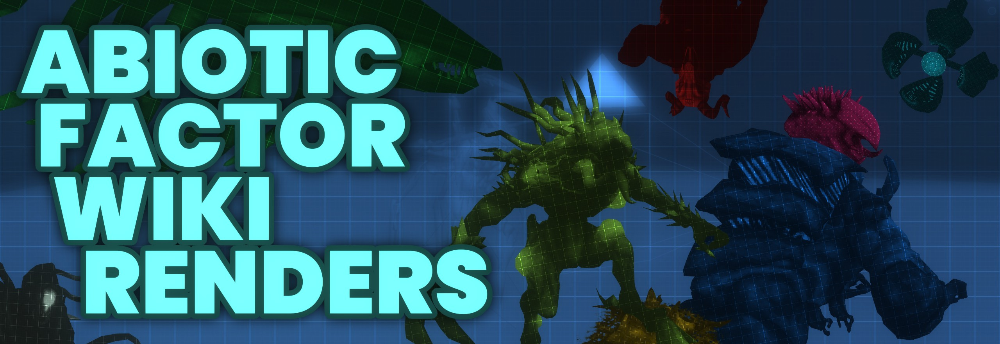

# Abiotic Factor Wiki Renders

## What
Renders and setup blend files for the [Abiotic Factor wiki page](https://abioticfactor.wiki.gg/) of different [entities](https://abioticfactor.wiki.gg/wiki/Entities) and maybe more..

## Where
Renders are [here](Renders).

Source Blend files are [here](Blends). Textures and HDRI not included. HDRI Used [here](https://dl.polyhaven.org/file/ph-assets/HDRIs/exr/2k/artist_workshop_2k.exr). Textures have to be ripped from the game files using Fmodel or similar. Requires [Pixel Manager](https://github.com/Joegenco/PixelManager) for correct color management settings.

## Why
To make collaboration and organization easier. Also to serve as a easy start point for community members wanting to use the Blend files for personal or artistic use.

## Who
Currently Nihal "Mulana" Rahman and Teejai
